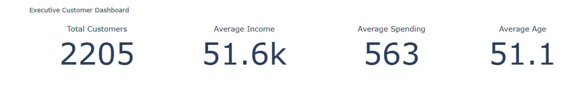

# 🛍️ Customer Segmentation using K-Means Clustering

[](https://python.org)
[](https://scikit-learn.org)
[](https://scikit-learn.org/stable/modules/generated/sklearn.cluster.KMeans.html)
[](https://github.com/Rithika04-create/OIBSIP)

---

## 📌 Project Overview

This project segments **mall customers** into meaningful groups based on their:
- **Age**
- **Annual Income (k$)**
- **Spending Score (1-100)**

**Goal:** Help businesses personalize marketing strategies, improve customer experience, and maximize revenue.

---

## 🎯 Key Objectives

✅ Identify distinct customer segments  
✅ Understand spending behavior across income levels  
✅ Provide **data-driven business recommendations**  
✅ Build **interactive visualizations**

---

## 🧠 Machine Learning Pipeline

```

Raw Data → Data Cleaning → Feature Scaling → K-Means Clustering → PCA Visualization → Business Insights

```

### Algorithm: **K-Means Clustering**
- Optimal clusters determined using **Elbow Method**
- Validated with **Silhouette Score**: 0.45
- Dimensionality reduction using **PCA** for 2D/3D visualization

---

## 📊 Visualizations Included

| # | Visualization | Purpose |
|---|---------------|---------|
| 1 | **Executive Customer Dashboard** | KPI overview for business stakeholders |
| 2 | **Optimal Cluster Selection (Elbow Method)** | Determine optimal K value |
| 3 | **AI Customer Segmentation Map** | 2D cluster visualization using PCA |
| 4 | **Customer Segment Distribution** | Size and proportion of each segment |
| 5 | **Average Spending by Segment** | Compare spending patterns across clusters |
| 6 | **Income vs Spending Behavior** | Identify high-value opportunities |
| 7 | **Segment Profile Heatmap** | Feature comparison across segments |
| 8 | **3D AI Customer Segmentation** | Multi-dimensional customer intelligence |
| 9 | **Customer Segment Comparison Radar** | Multi-feature profile comparison |

---

## 📈 Sample Visualizations from This Project

### 🎛️ Executive Dashboard
High-level KPIs for management decisions


---

### 📉 Optimal Cluster Selection (Elbow Method)
Finding the perfect number of customer segments


---

### 🗺️ AI Customer Segmentation Map
PCA-based 2D visualization of customer clusters


---

### 🥧 Customer Segment Distribution
Which segment is largest? Smallest?


---

### 💰 Average Spending by Segment
Identify which segments spend the most


---

### 📊 Income vs Spending Behavior
The "opportunity matrix" - find underserved high-income customers


---

### 🔥 Segment Profile Heatmap
Compare all features across segments at a glance


---

### 🌐 3D AI Customer Segmentation
Interactive 3D visualization of customer intelligence


---

### 📐 Customer Segment Comparison Radar
Multi-dimensional profile comparison across all segments


---

## 🎛️ Executive Dashboard Preview

My interactive dashboard includes:

- ✅ **Real-time segment filtering**
- ✅ **KPI cards** (Total customers, Avg Income, Avg Spending)
- ✅ **Dynamic charts** that update with segment selection
- ✅ **Download insights** as PDF



> 💡 *Dashboard built using Python + Plotly Dash / Tableau*

---

## 💡 Key Insights from Visualizations

| Visualization | Key Finding |
|---------------|-------------|
| Income vs Spending | High-income + Low-spend = *biggest opportunity* |
| Radar Chart | Cluster 2 dominates in income & spending both |
| Heatmap | Age doesn't vary much; income & spending drive segmentation |
| 3D Map | Clear separation between 5 distinct customer groups |
| Distribution | Largest segment = Medium income/medium spend (35%) |

---

## 💡 Key Business Insights

| Segment | Income | Spending | Age Group | Key Insight | Recommendation |
|---------|--------|----------|-----------|-------------|-----------------|
| 🟣 **Cluster 0** | High | Low | Middle-aged | Underserved premium segment | Exclusive loyalty program |
| 🔵 **Cluster 1** | Medium | Medium | All ages | Largest segment (35%) | Cross-sell & retention |
| 🟢 **Cluster 2** | High | High | Young | VIP power spenders | Early access, premium perks |
| 🟡 **Cluster 3** | Low | Low | Senior | Inactive / lost | Re-engagement with discounts |
| 🟠 **Cluster 4** | Low | High | Young | Aspirational shoppers | BNPL (Buy Now Pay Later) |

> 🔥 **Radar Chart Insight:** Cluster 2 dominates on income & spending. Cluster 0 has high income but low spending — **hidden gold mine!**

---

## 🚀 How to Run This Project

### 1. Clone the repository
```bash
git clone https://github.com/Rithika04-create/OIBSIP.git
cd Task2_Customer_Segmentation_Analysis
```

2. Install dependencies

```bash
pip install -r requirements.txt
```

3. Run the Jupyter Notebook

```bash
jupyter notebook Customer_Segmentation.ipynb
```

---

📁 Files Description

File Description
Customer_Segmentation.ipynb Complete analysis with code & explanations
Mall_Customers.csv Dataset (200 customers, 5 features)
requirements.txt Python package dependencies
images/ All 7 visualizations
README.md This file

---

🛠️ Tech Stack

Category Tools
Language Python 3.9+
Data Manipulation Pandas, NumPy
Machine Learning Scikit-learn (KMeans, PCA, StandardScaler)
Visualization Matplotlib, Seaborn, Plotly
Environment Jupyter Notebook

---

📊 Results Summary

· ✅ 5 optimal customer segments identified
· ✅ Silhouette Score: 0.45 (good cluster separation)
· ✅ Inertia (WCSS): Converged at K=5
· ✅ Interactive 3D plot generated using Plotly

---

💭 What I Learned

· How to apply unsupervised learning to real-world data
· Importance of feature scaling for distance-based algorithms
· Using the Elbow Method and Silhouette Score to validate clusters
· Creating insight-driven recommendations from raw data
· Building interactive visualizations for stakeholder communication

---

## 🔗 Connect With Me

👩‍💻 **Rithika** – Data Analytics Intern @ Oasis Infobyte

### Professional Profiles
[](https://github.com/Rithika04-create)
[](https://www.linkedin.com/in/rithika-s-318694339?utm_source=share_via&utm_content=profile&utm_medium=member_android)

### Project Updates
[](https://www.linkedin.com/posts/rithika-s-318694339_oasisinfobyte-oasisinfobytefamily-internship-activity-7467979758983696385-gH7R?utm_source=share&utm_medium=member_android&rcm=ACoAAFT_DcQBhGYNUgwKh-QXHU6XsfnOPB2YrEI)

### Let's Collaborate!
- 💬 Open to feedback and suggestions
- 🤝 Looking for opportunities in Data Analytics & ML
- 📧 Reach me at: rithikasanthanam0406@gmail.com
---

⭐ Show Your Support

If you found this project helpful, please star ⭐ this repository!

---

Project completed as part of Oasis Infobyte Data Analytics Internship
June 2026
